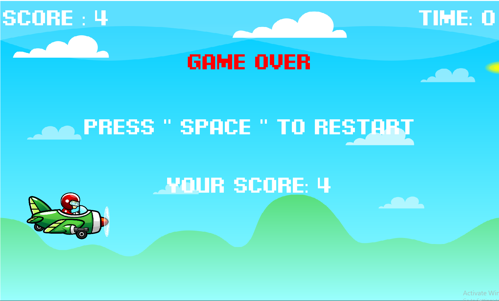

# Project Plane Of Bullet

สำหรับวิฃา .[OOP](https://wichit2s.github.io)

เว็บไซต์ .[Plane Of Bullet](https://github.com/fax1477/OOP-poject)

# application title: **Plane Of Bullet**

# author: 

  * id: 66114540829
  * name: นายอนุพล กุลสุทธิ์

# technology: [ pygame ]

# application description:
ปกติส่วนใหญ่เป็นเกมที่ต้องวิ่งวิ่งหนีหรือหลบกระสุนใช่มั้ยหล่ะครับแต่เกมของเราไม่ใช่แบบนั้นเกมของเราเป็นเกมที่ต้องวิ่งเข้าหากระสุนที่พุ่งเข้ามาครับ
## วิธีการใช้งาน โปรแกม

- ซิงค์ตัวโปรเจกเข้ากับ ตัวรันโปรแกรม
  
- pip install pygame
  
- กดรันได้เลย
  
* presentation: (https://www.canva.com/design/DAF-7iEyQCg/_VEc7_ErTFmUz9gITXihrw/view?utm_content=DAF-7iEyQCg&utm_campaign=designshare&utm_medium=link&utm_source=editor)
* video: link .[Present](video + slide)
